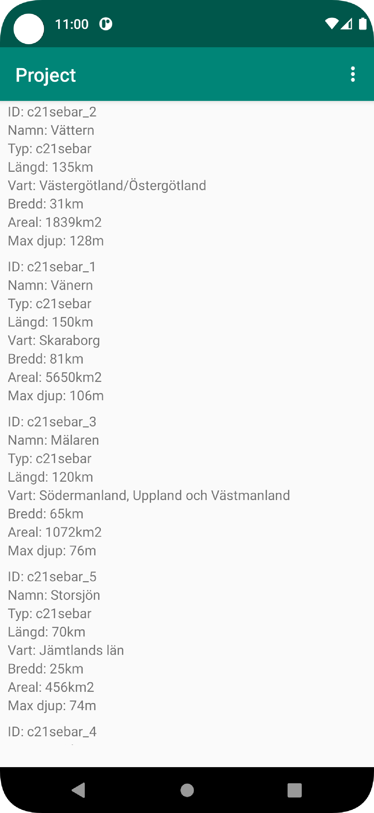
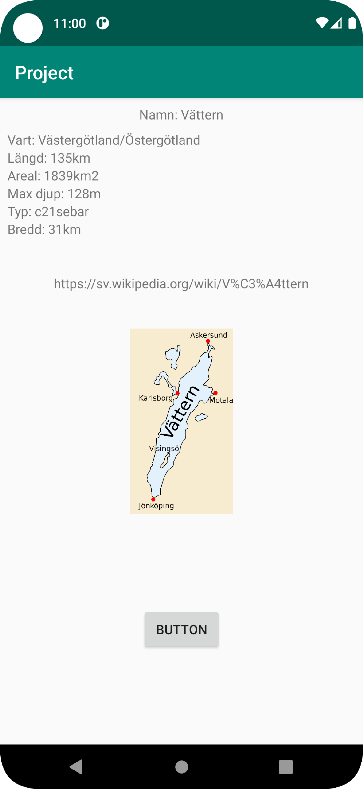
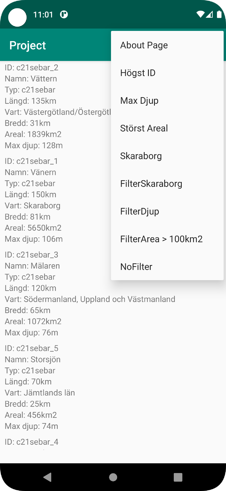
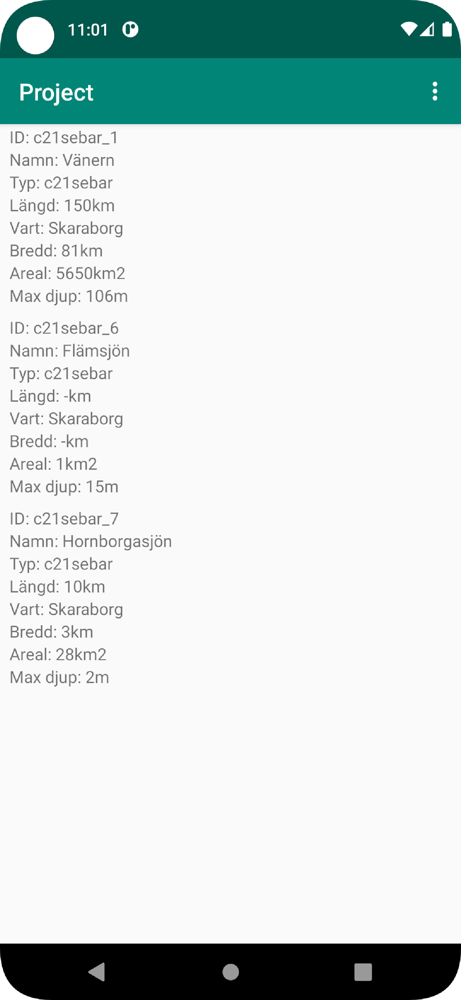

# Rapport

**App projekt**

Projektet är en slags kombination av alla de tidigare duggorna. Det blir som att de föregående duggorna är små pusselbitar och projektet är ett pussel där alla bitar faller på plats.
En recycler view skapades med tillhörande item. Itemet innehåller 8st textViews i en linearLayout med vertikal sortering.
Sedan skapades en itemAdapter för att kunna använda recyclerview och koppla rätt värden till rätt item.

Det skapades en Lake klass som innehåller strings och int med getters för varje värde. Lake klassen innehåller även en AuxData klass som har egna värden med getters.
Genom att kolla tillbaka på tidigare nätverksdugga där json-data introducerades och filer och kod som gav genom dugga gjorde jag två klasser där den ena klassen (JsonFile) läser in jsondata från en lokal fil och den andra klassen från nätet (JsonTask).

Jag använde mig av https://jsonlint.com/ för att validera och strukturera datan och en lokal fil för att testa appen.

Jag skapade en detaljvy när man klickar på ett item och skickar med data via intents.
I deltajvyn finns mer information och en bild som inte finns i recyclerview.
```Java
        holder.wikiLink = lakeList.get(position).getAuxdata().getWiki();
        holder.imgLink = lakeList.get(position).getAuxdata().getImg();
```

```Java
  itemView.setOnClickListener(new View.OnClickListener() {
                @Override
                public void onClick(View view) {
                    Intent intent = new Intent(mainActivity, SecondActivity.class);
                    intent.putExtra("ID",""+ ID.getText());
                    intent.putExtra("namn", "" + name.getText());
                    intent.putExtra("type", "" + type.getText());
                    intent.putExtra("company", "" + company.getText());
                    intent.putExtra("location", "" + location.getText());
                    intent.putExtra("category", "" + category.getText());
                    intent.putExtra("size", "" + size.getText());
                    intent.putExtra("cost", "" + cost.getText());
                    intent.putExtra("imgURL", "" + imgLink);
                    intent.putExtra("wikiLink", "" + wikiLink);

                    mainActivity.startActivity(intent);
                }
            });
```
För att visa bilden används tredjepartsbiblioteket picasso.
```Java
  imageView = findViewById(R.id.secondActivityImageView);
        Log.d("img", imgURL);
        Picasso.get().load(imgURL).into(imageView);
```

Genom att kolla tillbaka på internal/external web page duggan där en menyknapp användes kunde jag skapa en egen meny knapp och lägga till meny alternativ där.
Ett av alternativen är about som beskriver vad det är för typ av app och vad för målgrupp appen är tänkt för.
```XML
<menu xmlns:android="http://schemas.android.com/apk/res/android"
    xmlns:app="http://schemas.android.com/apk/res-auto"
    >
    <item
        android:id="@+id/showAboutPage"
        android:orderInCategory="001"
        android:title="About Page"
        app:showAsAction="never" />
```
```Java
    public void showAboutPage(){
        Log.d("menu","Öppna about page");
        Intent intent = new Intent(this, AboutActivity.class);
        this.startActivity(intent);
    }
public boolean onOptionsItemSelected(MenuItem item) {
        // Handle action bar item clicks here. The action bar will
        // automatically handle clicks on the Home/Up button, so long
        // as you specify a parent activity in AndroidManifest.xml.
        int id = item.getItemId();

        //noinspection SimplifiableIfStatement
        if (id == R.id.sortByHigestID) {
            Log.d("menu","Sorting by highest ID");
            sortByID();
            return true;
        }

        if (id == R.id.showAboutPage) {
            Log.d("menu","Opens about page");
            showAboutPage();
            return true;
        }
```
När funktionaliteten i appen var klar laddade jag upp data till webtjänsten och bytte från att använda lokal fil till att hämta och använda jsondatan från webtjänsten.
```Java
    private final String JSON_FILE = "lakes.json";
    private final String JSON_URL = "https://mobprog.webug.se/json-api?login=c21sebar";
```
```Java
        new JsonTask(this).execute(JSON_URL); //för url
        //new JsonFile(this, this).execute(JSON_FILE); //För lokalt
```

Andra meny alternativ är sortering och filter för recyclerview.
Filter är ett krav för VG medans sortering var en egen feature jag ville implementera.

Ett annat krav för VG var att kunna spara filter mellan nedstänging och uppstart av applikationen.
Detta löstes genom att kolla tillbaka på dugga och appen jag skapade med sharedpreferences.
När ett filter och sortering metod körs så sparas en sträng i sharedpreferences med nyckeln filter respektive sort.
```Java
 public void sortBySkaraborg(){
        Collections.sort(itemAdapter.getLakeList(), new Comparator<Lake>() {
            @Override
            public int compare(Lake lake1, Lake lake2) {
                if (lake1.location.contains("Skaraborg") && !lake2.location.contains("Skaraborg")) {
                    return 1;
                }else if (!lake1.location.contains("Skaraborg") && lake2.location.contains("Skaraborg")) {
                    return -1;
                }
                return 0;

            }
        });
        Log.d("menu","Sortera efter Skaraborg");
        Collections.reverse(itemAdapter.getLakeList());
        itemAdapter.notifyDataSetChanged();
        myPreferenceEditor.putString("Sort", "Skaraborg");
        myPreferenceEditor.apply();
    }
```
```Java
    void filterBySkaraborg(){
        List<Lake> filterListLake = new ArrayList<>();
        for (int i =0; i<listLake.size(); i++){
            if ("Skaraborg".equalsIgnoreCase(listLake.get(i).getLocation())){
                filterListLake.add(listLake.get(i));
            }
        }
        itemAdapter.setLakeList(filterListLake);
        itemAdapter.notifyDataSetChanged();
        myPreferenceEditor.putString("Filter", "filterSkaraborg");
        myPreferenceEditor.apply();

    }
```


När appen startas görs en koll på sharedpreferences och sparar de värdet i en variabel som anävnds i ett switch statement.
Om inget av värdena i sharedpreferences stämmer överns med de olika case i switch så körs default.
Om en stärng skulle matcha ett case i switch körs det caset.

```Java
void loadFilterSort(){

        String readSort = myPreferenceRef.getString("Sort","0");
        String readFilter = myPreferenceRef.getString("Filter","0");
        Log.d("sort","readSort: " + readSort);
        Log.d("sort","readFilter: " + readFilter);
        switch (readSort){
            case "ID": {
                sortByID();
               // itemAdapter.notifyDataSetChanged();
                Log.d("sort","ID sortering laddad");
                break;
            }
            case "Areal":{
                sortByAreal();
               // itemAdapter.notifyDataSetChanged();
                Log.d("sort","Areal sortering laddad");
                break;

            }
            case "Djup":{
                sortByDjup();
               // itemAdapter.notifyDataSetChanged();
                Log.d("sort","Djup sortering laddad");
                break;
            }
            case "Skaraborg":{
                sortBySkaraborg();
                //itemAdapter.notifyDataSetChanged();
                Log.d("sort","Skaraborg sortering laddad");
                break;

            }
            default:{
                Log.d("sort","Ingen sortering laddad");
                noFilter();
                itemAdapter.notifyDataSetChanged();
            }
        }
        switch (readFilter){

            case "filterSkaraborg":{
                filterBySkaraborg();
                break;
            }
            case "filterArea":{
                filterByArea();
                break;
            }
            case "filterDjup":{
                filterByDjup();
                break;
            }
            case "noFilter":{
                noFilter();
                break;
            }
            default:{
                noFilter();
                itemAdapter.notifyDataSetChanged();
            }
        }

    }

```



